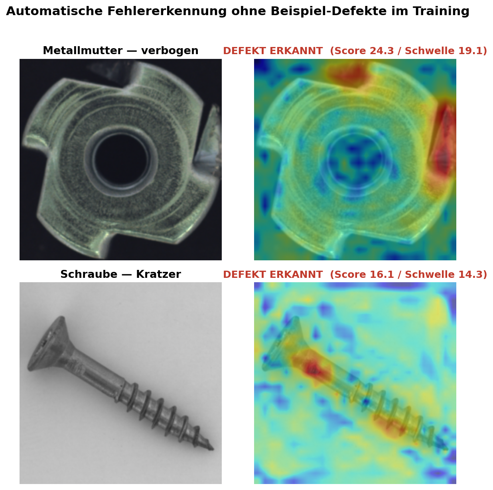

# Automatische Fehlererkennung fuer Metallbauteile (KI-gestuetzt)

Ein KI-System, das Kratzer, Verformungen und andere Defekte an Metallbauteilen
automatisch erkennt -- **ohne dass ihm jemals ein defektes Bauteil gezeigt
wurde**. Es lernt nur, wie "gut" aussieht, und schlaegt bei jeder Abweichung
Alarm. Trainiert und getestet an zwei Bauteilarten, die in der
Praezisionsfertigung (z. B. Triebwerksmontage) typisch sind: Metallmuttern
und Schrauben.



## Ergebnisse auf einen Blick

| Bauteil | Fehler korrekt erkannt | Trainiert mit |
|---|---|---|
| Metallmutter | **100 %** der Testbilder korrekt klassifiziert | nur 220 fehlerfreie Bilder |
| Schraube | **96 %** der Testbilder korrekt klassifiziert | nur 320 fehlerfreie Bilder |

Zum Einordnen: Die zugrunde liegende Methode (PatchCore, Roth et al. 2022)
erreicht in der wissenschaftlichen Originalarbeit im Schnitt ca. 99 % ueber
15 verschiedene Bauteilarten -- die Ergebnisse hier liegen also im
State-of-the-Art-Bereich.

**Fertig nutzbar**: Das trainierte System ist als REST-API verpackt (per
Docker startbar) -- ein Foto hochladen, in unter einer Sekunde Antwort:
defekt oder nicht, plus Heatmap, die zeigt *wo*.

---

## Technischer Hintergrund

Bildbasierte Anomalieerkennung fuer Metallbauteile ohne Trainings-Labels fuer
Defekte: Ein Modell lernt ausschliesslich aus fehlerfreien Bauteilbildern und
markiert zur Testzeit Abweichungen sowohl auf Bild- als auch auf
Pixel-Ebene (Heatmap). Umgesetzt mit [PatchCore](https://arxiv.org/abs/2106.08265)
(Roth et al., 2022), bereitgestellt als FastAPI-Service in Docker.

Kategorien: `metal_nut` (Metallmutter) und `screw` (Schraube) aus dem
[MVTec-AD-Datensatz](https://www.mvtec.com/company/research/datasets/mvtec-ad) --
bearbeitete Praezisions-Metallteile, nah an Bauteilinspektion in der
Fertigung/Montage.

## Funktionsprinzip

1. **Feature-Extraktion**: Eingefrorenes, ImageNet-vortrainiertes
   WideResNet-50 liefert Feature-Maps aus `layer2` und `layer3` (kein
   Training des Backbones noetig).
2. **Locally Aware Patches**: 3x3-Average-Pooling pro Feature-Map + Resize/
   Concat von layer2+layer3 ergibt pro Bild eine Grid von Patch-Feature-Vektoren
   mit lokalem Kontext.
3. **Memory Bank**: Alle Patch-Vektoren aller guten Trainingsbilder werden
   gesammelt.
4. **Greedy Coreset Subsampling**: Eine repraesentative Teilmenge (Standard: 1 %)
   wird per Greedy-k-Center-Auswahl (mit Random-Projection zur Beschleunigung)
   behalten -- schnellere Suche bei minimalem Genauigkeitsverlust
   ([`src/memory_bank.py`](src/memory_bank.py)).
5. **Scoring**: Zur Testzeit wird fuer jeden Patch der naechste Nachbar in der
   Memory Bank per FAISS gesucht; die Distanz ist der Anomaly Score. Upsampling
   ergibt die Heatmap, ein reweighteter Max-Score den Bild-Score
   ([`src/patchcore.py`](src/patchcore.py)).

## Setup

Voraussetzung: Python 3.11 (PyTorch unterstuetzt 3.14 noch nicht). Falls nicht
vorhanden: `brew install python@3.11`.

```bash
python3.11 -m venv venv
./venv/bin/pip install -r requirements.txt
```

**macOS-Hinweis**: PyTorch und FAISS bringen jeweils eine eigene
OpenMP-Runtime mit, was ohne Workaround zu einem Absturz fuehrt. Alle
Einstiegspunkte (`train.py`, `evaluate.py`, Tests) setzen das automatisch via
[`src/env_setup.py`](src/env_setup.py) (Re-Exec mit den noetigen Env-Vars).
Fuer die lokal per `uvicorn` gestartete API: `./run_api.sh` verwenden statt
`uvicorn` direkt aufzurufen (im Docker-Image ist es bereits per `ENV` gesetzt).

## Datensatz

Der offizielle Download erfordert das Ausfuellen eines kurzen Formulars und
die Zustimmung zu MVTec's Forschungslizenz -- das automatisiere ich bewusst
nicht:

1. Archiv `mvtec_anomaly_detection.tar.xz` herunterladen:
   https://www.mvtec.com/company/research/datasets/mvtec-ad/downloads/
2. Nur die benoetigten Kategorien extrahieren:

   ```bash
   ./venv/bin/python scripts/prepare_data.py --archive ~/Downloads/mvtec_anomaly_detection.tar.xz
   ```

   Ergebnis: `data/metal_nut/` und `data/screw/` im MVTec-Standardlayout
   (`train/good/`, `test/<defect_type>/`, `ground_truth/<defect_type>/`).

## Training & Evaluation

```bash
./venv/bin/python train.py --category metal_nut
./venv/bin/python train.py --category screw

./venv/bin/python evaluate.py --category metal_nut
./venv/bin/python evaluate.py --category screw
```

`evaluate.py` schreibt Metriken (Image-AUROC, Pixel-AUROC, PRO-Score,
F1-optimaler Threshold) und Heatmap-Visualisierungen nach `outputs/<category>/`
und speichert den Threshold zusaetzlich in `models/<category>/threshold.json`
fuer die API.

**Coreset-Ratio als Performance/Genauigkeits-Kompromiss**: `--coreset-ratio`
(Standard `0.01`, wie im Paper) steuert, wie stark die Memory Bank
komprimiert wird -- kleiner = schnellere Suche, groesser = potenziell
praezisere Scores. Guter Vergleichspunkt fuer den README-Ergebnisteil unten.

## API

```bash
./run_api.sh
# oder in Docker, siehe unten
```

Endpoints:

| Methode | Pfad                  | Beschreibung                          |
|---------|-----------------------|----------------------------------------|
| GET     | `/health`              | Status + geladene Kategorien          |
| GET     | `/categories`          | Verfuegbare trainierte Kategorien     |
| POST    | `/predict/{category}`  | Bild hochladen -> Score + Heatmap     |

```bash
curl -X POST "http://localhost:8000/predict/metal_nut" \
  -F "file=@data/metal_nut/test/scratch/000.png"
```

Antwort:

```json
{
  "category": "metal_nut",
  "image_score": 12.4,
  "threshold": 9.8,
  "is_anomaly": true,
  "heatmap_base64": "..."
}
```

## Docker

```bash
docker build -t patchcore-anomaly-detection .
docker run -p 8000:8000 -v $(pwd)/models:/app/models patchcore-anomaly-detection
```

Setzt trainierte Modelle unter `models/<category>/` voraus (per `train.py` +
`evaluate.py` erzeugt).

## Metriken

- **Image-AUROC**: Trennt das Modell gute von defekten Bildern korrekt?
- **Pixel-AUROC**: Stimmt die Heatmap mit der Ground-Truth-Maske ueberein?
- **PRO-Score**: Per-Region-Overlap (MVTec-AD-Paper) -- gewichtet auch kleine
  Defektregionen fair, nicht nur die pixelweise Gesamtflaeche.

Referenz aus dem PatchCore-Paper: ca. 99 %+ Image-AUROC auf MVTec-AD.

## Ergebnisse

Trainiert auf dem vollstaendigen MVTec-AD-Trainingssplit (220 Bilder fuer
`metal_nut`, 320 fuer `screw`), Coreset-Ratio 1 %, WideResNet-50-Backbone:

| Kategorie   | Image-AUROC | Pixel-AUROC | PRO-Score | Testbilder |
|-------------|-------------|-------------|-----------|------------|
| metal_nut   | 1.0000      | 0.9822      | 0.9177    | 115        |
| screw       | 0.9637      | 0.9808      | 0.9014    | 160        |

Zum Vergleich: Das PatchCore-Paper erreicht auf MVTec-AD im Schnitt uber alle
15 Kategorien ca. 99,1 % Image-AUROC -- unsere beiden Kategorien liegen mit
1,00 (metal_nut) und 0,964 (screw) in der gleichen Groessenordnung. `screw`
ist die schwierigere der beiden Kategorien (feinere, teils sehr subtile
Defekte wie `scratch_neck`/`thread_side`), was sich auch im Paper so zeigt.

Beispiel-Heatmaps liegen unter `outputs/metal_nut/` und `outputs/screw/`
(Original | Ground-Truth-Maske | Heatmap | Overlay, je Bild).

## Projektstruktur

```
src/
  config.py             Zentrale Konfiguration (Kategorien, Hyperparameter)
  dataset.py            MVTec-AD Dataset-Loader
  feature_extractor.py  WideResNet50-Feature-Extraktion (layer2+3)
  memory_bank.py        Feature-Extraktion ueber alle Trainingsbilder + Coreset-Sampling
  patchcore.py          PatchCore-Modell: fit/predict/save/load, FAISS-Suche, Reweighting
  metrics.py            Image-/Pixel-AUROC, PRO-Score, F1-Threshold
  visualize.py           Heatmap-Overlay-Plots
  env_setup.py           macOS OpenMP-Workaround
api/
  main.py                FastAPI-Service
  schemas.py             Request-/Response-Modelle
train.py / evaluate.py   CLI fuer Training/Evaluation pro Kategorie
scripts/prepare_data.py  Extrahiert benoetigte Kategorien aus dem MVTec-Archiv
tests/test_pipeline.py   End-to-End Smoke-Test mit synthetischen Daten (kein Download noetig)
```
